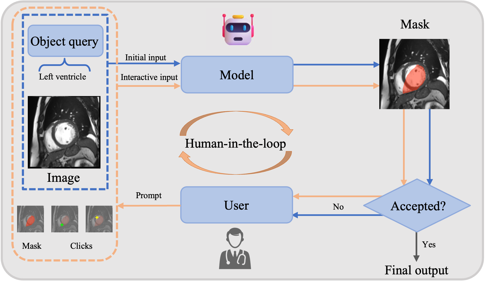

# Verse_1.0

# VerSe: Integrating Multiple Queries as Prompts for Versatile Cardiac MRI Segmentation

## Abstract
Despite the advances in learning-based image segmentation
approach, the accurate segmentation of cardiac structures from magnetic
resonance imaging (MRI) remains a critical challenge. While existing
automatic segmentation methods have shown promise, they still require
extensive manual corrections of the segmentation results by human ex-
perts, particularly in complex regions such as the basal and apical parts
of the heart. Recent efforts have been made on developing interactive
image segmentation methods that enable human-in-the-loop learning.
However, they are semi-automatic and inefficient, due to their reliance on
click-based prompts, especially for 3D cardiac MRI volumes. To address
these limitations, we propose VerSe, a Versatile Segmentation frame-
work to unify automatic and interactive segmentation through mutiple
queries. Our key innovation lies in the joint learning of object and click
queries as prompts for a shared segmentation backbone. VerSe supports
both fully automatic segmentation, through object queries, and interac-
tive mask refinement, by providing click queries when needed. With the
proposed integrated prompting scheme, VerSe demonstrates significant
improvement in performance and efficiency over existing methods, on
both cardiac MRI and out-of-distribution medical imaging datasets.

## Features
- Unified framework for automatic and interactive segmentation.
- Integration of object and click queries for enhanced versatility.
- Evaluated on both cardiac MRI and out-of-distribution medical imaging datasets.

## Example
Below is an example visualization of our VerSe framework:

